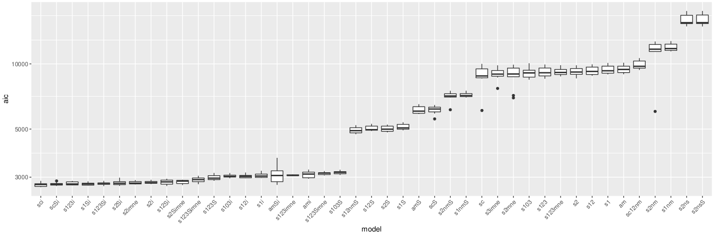
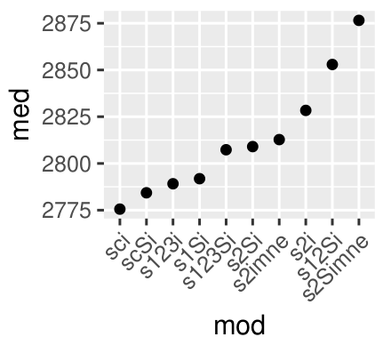
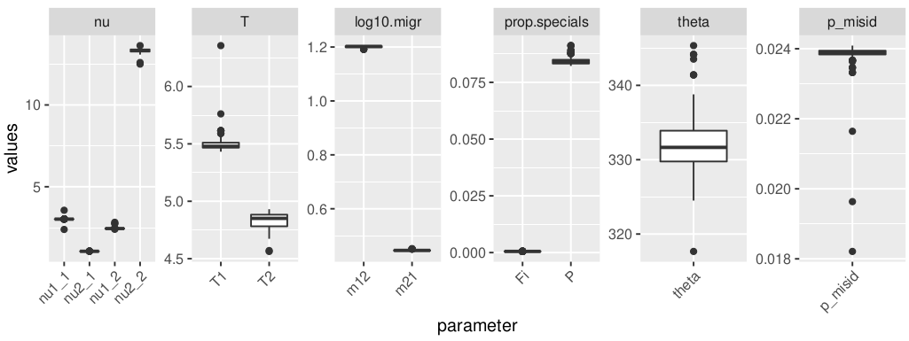

# Multimodel demographic inference using *moments*

[*Moments*](https://bitbucket.org/simongravel/moments/src/master/) is the site frequency spectrum (SFS) analysis method superficially similar to *dadi* but operating on different math (ordinary differential equations rather than diffusion approximation). It is considerably faster than *dadi* (although somewhat less accurate), handles up to five populations simultaneously, and plots cartoons of inferred demographic scenarios.

The problem with *moments* and *dadi* is, they can evaluate the fit of a pre-specified demographic model but are **not designed to search for the general model structure** that best fits the data (i.e., was there population split or not, is there any migration and if yes, were there additional growth periods before or after spit, etc). Our solution to this problem is pretty simple: to fit all the two-population models we can possibly think of to our experimental 2dSFS and use Akaike Information Criterion to select the best one.

See [GADMA](https://github.com/ctlab/GADMA) for the alternative solution to this problem. Compared to GADMA, we are far less elegant but somewhat more flexible (we can incorporate essentially any model, including models involving background selection and heterogeneous introgression rates across the genome). Our approach also lets the user evaluate how much better the winning model is compared to certain "null" alternatives (for example, models with no population split or with constant population sizes), which provides statistical evidence for general aspects of the model structure. Our disadvantage (besides the fact that we only do two-pop models and GADMA also does three-pop models) is a huge number of model-fit runs that we have to perform. The good news is, all this can be done in parallel.

Version 2 (***still very beta! use at your own risk***) of this repository (`multimodel_inference/py3_v2`) actually uses GADMA genetic algorithm for find optimal parameters of a pre-specified model, which makes it much more robust, and has a completely revamped set of models to compare. The new models don't have versions with symmetrical migration (like in version 1), but include models with "background selection" (reduced Ne in a portion of the genome), "islands of divergence" (reduced migration in a portion of the genome) and a combination of the two. The previous version of the model collection is still there, with all corresponding scripts (python and R) in subdirectories `multimodel_inference/py2_v1` and `multimodel_inference/py3_v1`.

## Installation ##
First of all, install *moments*. The example below would clone it into the user's home directory and install it for a specific user.
```bash
cd
git clone --branch devel https://bitbucket.org/simongravel/moments.git 
cd moments
python3 setup.py build_ext --inplace
cd
# add moments to $PYTHONPATH (consider adding this line to your .bashrc):
export PYTHONPATH=$PYTHONPATH:$HOME/moments
```
Then, (**if you want to try version 2**) install GADMA:
```bash
# if you are root user:
sudo python3 -m pip install numpy
sudo python3 -m pip install gadma

# if not:
python3 -m pip install --user numpy
python3 -m pip install --user gadma
export PYTHONPATH=$PYTHONPATH:$HOME/.local/bin
```

Then, clone this repository and copy all the scripts and accessory filed *for the version you'd like to work with* into a newly created subdir `work`:

```bash
cd
git clone https://github.com/z0on/AFS-analysis-with-moments.git
cd AFS-analysis-with-moments
mkdir work
# to use version 1 models:
cp multimodel_inference/py3_v1/* work/
# to use version 2 models - BETA WARNING! If results don't make sense please do tell me
# cp multimodel_inference/py3_v2/GA/* work/
# to use version 1 models for python2
# cp multimodel_inference/py2_v1/* work/
```

> NOTE: all code examples here assume the repository is cloned in the home directory, `~/`. If you cloned it elsewhere, make sure to replace `~/AFS-analysis-with-moments` in all examples with the actual path.

> NOTE: R scripts were tested with R versions 3.5.1 and 3.6.3. Not sure about R version 4.

## Overview of the method ##
- The first step is **model selection**, where we run all possible models on 10 bootstrapped SFS. We  run each model on each bootstrap three times (three random restarts), to make sure the model converges to its best likelihood at least once. All these commands are written by the `R` script `modSel_write.R`. Then we use the `R` script `modSel_summary.R` to select the best-fitted instance (out of 3) for each model for each bootstrap, and compare the AIC scores for all models. The best model is the one with the *lowest median AIC score among bootstrap replicates*.  
- The second step is running the winning model on 100 bootstrapped SFS, to **evaluate parameter uncertainties**. The commands for this stage are actually written by the `modSel_summary.R` script. Once again, we are doing 6 random restarts for each bootstrap replicate. The parameter meanings and uncertainties are deciphered by the third `R` script that we have, `bestBoot_summary.R`. All three `R` scripts are designed for command-line usage.

## Overview of models ##
The models are designed to test the following basic aspects of population configuration:
- are these really two demographically distinct populations, or we simply sampled the same population twice? (i.e., does the model fits significantly better if it actually has a split between populations, as opposed to just some population size changes)
- were there changes in population size(s) through time? (models can include up to three "epochs" where population size could change)
- if there is a split, is there still migration? (during some or all of the epochs)
- **(version 1 only)** if there is migration, is it symmetric or asymmetric?
- do some parts of the genome ("islands of differentiation") introgress at a lower rate than the rest? This is one way to model non-neutral processes such as spatially varying selection.
- **(version 2 only)** do some parts of the genome show lower population size than the rest? This is to model background selection.


So the models differ by: 
- split / no split (`ns` in the model name)
- no migration ever (`nm`), or some migration (all other models)
- number of epochs (1-3) (`s1`,`s2` or `s3`) 
- migration at some or all of the epochs (there are models with secondary contact, `sc`, or ancestral migration, `am`)
- models with ancestral population size change before split (`12` with one epoch post-split, `123` with two epochs post-split, `103` is the secondary contact version of `123` - no migration in the middle epoch)
- presence of "islands of differentiation" (`i`)
- **(version 2 only)** presence of islands of "background selection" (`S`).


>NOTE for version 1: the model names are not fully standardized to the above convention, please see `work/moments_multimodels.xlsx` for their structure.


>NOTE for version 2: `IM` models are currently not included in the main collection of models since they take substanitally longer to fit (some can take 4-5 hours). All v.2 IM models are of `mne` kind, which means that migration scales dynamically with the size of the source population. If you want to include them, copy the extended model lists over the standard ones:
```bash
cp ~/AFS-analysis-with-moments/work/allmodels_IMextra_unfolded ~/AFS-analysis-with-moments/work/allmodels_unfolded
cp ~/AFS-analysis-with-moments/work/allmodels_IMextra_folded ~/AFS-analysis-with-moments/work/allmodels_folded
```

See the spreadsheet `work/moments_multimodels.xlsx` (v.1) or cfor summaries of model structure.


## Model selection ##
Let's assume we have ten bootstrapped 2dSFS formatted for *moments* or *dadi* (See **Appendix** for instructions how to obtain bootstrapped 2dSFS from [ANGSD](http://www.popgen.dk/angsd/index.php/ANGSD)). Such file is nothing more than a line of numbers with a header line giving the dimensions of the spectrum ( 2 x N + 1 for each of the two populations, where N is the number of sampled diploids). 
Bootstrapped SFS files should be named like `p12_1.sfs`, `p12_2.sfs`, etc. where `p12` is the name of population contrast.

To create a list of AFS models to run, do this:

```bash
cd [where your boostrapped SFS files are]
Rscript ~/AFS-analysis-with-moments/work/modSel_write.R contrast=p12 args="p1 p2 16 16 0.02 0.005"
```
where
- `contrast` : the name of population comparison. It should match the leading part of the bootstapped SFS names (in example here, `p12`)
- `args`     : list of parameters for AFS models, in the following order: name of pop1, name of pop2, projection for pop1, projection for pop2, mutation rate (per genotyped portion of the genome per generation), generation time in thousands of years. 

Population names can be anything. For ANGSD-derived SFS, projections should be 1.6N for each population (rounded to integer); in the case shown here, each population was represented by 10 individuals.

Additional arguments to `modSel_write.R` (defaults):
- `nreps` (3)   : number of random restarts for each model for each bootstrap rep.
- `nboots` (10) : number of bootstrap replicates to use. 10 seems to be optimal at this stage.
- `path2models` (~/AFS-analysis-with-moments/multimodel_inference/) : path to where model listings live
- `folded` (FALSE) : whether to fold the SFS for analysis
> Note: if you want to analyze folded SFS, generate unfolded ones and specify `folded=TRUE` here and at the next stage.

Run all commands in `[contrast].modsel.runs` file. This is the most computaitonally intensive thing I have ever done - in version 1, there are 6 x 108 x 10 model runs, requiring 1 hour each. Best run these on an HPC cluster, in parallel! All the screen output is going to be collected in a file, `p12.modsel` in this case.


>Note: some model runs may not finish in 1 hour; just kill them. These are hopeless runs where the parameter search algorithm is stuck, they will have horrible fit even if they eventually finish.

Then, to summarize results and write the list of commands for the next step (bootstrapping the winnign model):
```bash
Rscript ~/AFS-analysis-with-moments/work/modSel_summary.R modselResult=p12.modsel args="p1 p2 16 16 0.02 0.005"
```
where
- `modselResult` : the name of the resulting file from model selection, typically `[contrast].modsel`. 
- `args`     : same argument as for `modSel_write.R`

Additional arguments to `modSel_summary.R` that will influence the next stage, bootstrapping the winning model (defaults):
- `nreps` (3)   : number of random restarts for each model for each bootstrap rep.
- `nboots` (100) : number of bootstrap replicates.
- `folded` (FALSE) : whether analysis is using folded SFS.

Two plots will be generated. The first one is the boxplot of best AIC scores for each model for all bootstrap replicates:


And the second one is the plot of just the AIC medians for the top 10 models:



The script also outputs the text file named `[contrast].[modelname]`, **where `[modelname]` is the name of the winning model**. This file contains the fitted parameter values for the winning model, which will be used at the next stage as "guiding values" for random restarts.

Lastly, the script outputs a file `[contrast].winboots.runs` that contains all the commands to run the next stage.

## Bootstrapping the winning model ## 
Assuming we have 100 boostrapped SFS (See **Appendix** for instructions how to obtain bootstrapped 2dSFS from [ANGSD](http://www.popgen.dk/angsd/index.php/ANGSD)), we are now going to run just the winning model on all of them. The commands file to do that has been already created by running `modSel_summary.R`, in the current example it is the file `p12.winboots.runs`. Now we need to do is to run all these commands, much preferably in parallel. As before, let them run for one hour, kill all that did not finish.

The text output will be collected in the file `p12.winboots`. To summarize it all we need to do is
```bash
Rscript ~/AFS-analysis-with-moments/work/bestBoot_summary.R bootRes=p12.winboots
```
Additonal options to `bestBoot_summary.R` are:
- `topq`: top quantile cutoff. Only boostrap runs in this top quantile will be summarized. Default 0.5
- `path2models`: path to the subdir `multimodel_inference`. Default `~/AFS-analysis-with-moments/multimodel_inference/`.
- `folded` (FALSE) : whether the analysis must fold the SFS.

This will generate the boxplots for parameter estimates:


> Note: names of migration rate parameters are not entirely systematized across models (I should spend some time cleaning those). In general the higher number (i.e. `_3` in `m12_3`) indicates later epoch, but they may not exactly follow the number of epochs actually present in the model.

The script also saves an RData bundle containing the summary dataframe (medians, 25% quantile, 75% quantile for all parameters) and the big dataframe containing all summarized bootstrap data.

Last but not least, the script identifies the model run that is the closest to the median across bootstrap replicates and saves two plots for it: 
- `[input filename]_representativeModel.png` : model structure
- `[input filename]_representativeModel.pdf` : comparison of real and model-derived SFS.


## Appendix ## 

### Obtaining bootstrapped SFS with ANGSD ###

Here we obtain 100 series of 5 block-bootstrap replicates, which we then average. This averaging procedure is called "bagging" and is meant to mitigate the noise that ANGSD-derived SFS often show in the area of high-frequency (implying low count) variants. The resulting 100 "bagged" datasets are going to be our bootstrap replicates.

Let's assume we have two populations, `p1` and `p2`, each with 10 sequenced individuals, and we have two text files, `p1.bams` and `p2.bams`, listing `*.bam` files for each population. First we need to collect sites (variable and invariable!) that pass our filters in both populations:

```bash

GRate=0.8 # genotyping rate filter - a site must be genotyped in this fraction of all samples.
cat p1.bams p2.bams > p12.bams

FILTERS='-uniqueOnly 1 -skipTriallelic 1 -minMapQ 30 -minQ 30 -doHWE 1 -maxHetFreq 0.5 -hetbias_pval 1e-5 -minInd $MI'
# add `-sb_pval 1e-5` (strand bias) to FILTERS if you have 2bRAD, GBS, or WGS data. Other types of RAD only sequence one strand so -sb_pval filter would remove everything.

TODO='-doMajorMinor 1 -doMaf 1 -dosnpstat 1 -doPost 2'
echo 'export NIND=`cat p12.bams | wc -l`; export MI=`echo "($NIND*$GRate+0.5)/1" | bc`' >calc
source calc && angsd -b p12.bams -GL 1 -P 4 $FILTERS $TODO -out p12 &

# wait a while...

zcat p12.mafs.gz | cut -f 1,2 | tail -n +2 > goodsites
angsd sites index goodsites

```
Next, we use the same `goodsites` to obtain SAF data for both populations:
>Note: don't worry about folding at this point. We will fold the spectra later, when running *moments* models, if needed.

```bash
export GENOME_REF=mygenome.fasta # reference to which the reads were mapped
TODO="-doSaf 1 -doMajorMinor 1 -doMaf 1 -doPost 1 -anc $GENOME_REF -ref $GENOME_REF"
angsd -sites goodsites -b p1.bams -GL 1 -P 4 $TODO -out p1 &
angsd -sites goodsites -b p2.bams -GL 1 -P 4 $TODO -out p2 &
```

Now we generate the bootstrapped data (100 series of 5 bootstraps):

```bash
export GENOME_REF=mygenome.fasta # reference to which the reads were mapped
>b100
for B in `seq 1 100`; do
echo "sleep $B && realSFS p1.saf.idx p2.saf.idx -ref $GENOME_REF -anc $GENOME_REF -bootstrap 5 -P 1 -resample_chr 1 >p12_$B">>b100;
done

```
Execute all commands in `b100` - this will take a while so better do it in parallel.
Finally, we do "bagging" (averaging of 5 bootstrap replicates within each of the 100 series):

```bash
SFSIZE="21 21" # 2N+1 for each population. In this case we assume that we have sampled 10 diploid individuals from each `p1` and `p2`.
for B in `seq 1 100`; do
echo $SFSIZE >p12_${B}.sfs;
cat p12_${B} | awk '{for (i=1;i<=NF;i++){a[i]+=$i;}} END {for (i=1;i<=NF;i++){printf "%.3f", a[i]/NR; printf "\t"};printf "\n"}' >> p12_${B}.sfs;
done

```
And voila, we have 100 "bagged" bootstrapped SFS spectra named `p12_1.sfs`, `p12_2.sfs`, ..., `p12_100.sfs`.

### Links ###

[Link to original *Moments* paper]( http://www.genetics.org/content/early/2017/05/08/genetics.117.200493)

[*Moments* manual](https://bitbucket.org/simongravel/moments/raw/efc4da3047226e3662dd43b525e41c85b93e90fd/doc/manual/manual.pdf) (link may change with updates)
