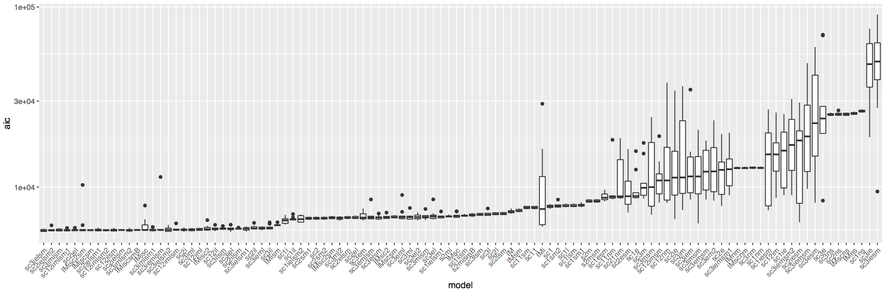
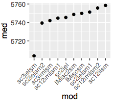
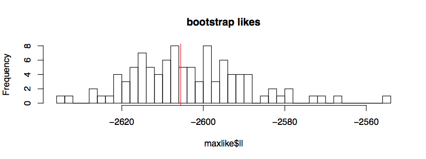
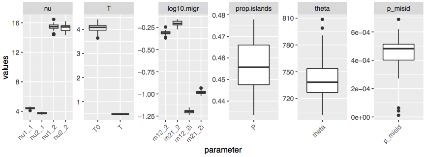

# Multimodel demographic inference using *moments* 

[*Moments*](https://bitbucket.org/simongravel/moments/src/master/) is the site frequency spectrum (SFS) analysis method superficially similar to *dadi* but operating on different math (ordinary differential equations rather than diffusion approximation). It is considerably faster than *dadi* (although somewhat less accurate), handles up to five populations simultaneously, and plots cartoons of inferred demographic scenarios.

The problem with *moments* and *dadi* is, they can evaluate the fit of a pre-specified demographic model but are **not designed to search for the general model structure** that best fits the data (i.e., was there population split or not, is there any migration and if yes, is it symmetrical or not, were there additional growth periods before or after spit, etc). The idea of this repository to solving this problem is pretty simple: to fit all the two-population models we can possibly think of to our experimental 2dSFS and use Akaike Information Criterion to select the best one.

See [GADMA](https://github.com/ctlab/GADMA) for the alternative solution to this problem. Compared to GADMA, we are far less elegant but somewhat more flexible (we can incorporate essentially any model, for example, involving selection and heterogeneous introgression rates across the genome). Our approach also lets the user evaluate how much better the winning model is compared to certain "null" alternatives (for example, models with no population split, with symmetrical migration, or with constant population sizes), which provides statistical evidence for general aspects of the model structure. Our disadvantage is a ridiculously huge number of model-fit runs that we have to perform; the good news is, all this can be done in parallel, and each single-model run takes no more than 1 hour.

## Installation ##
First of all, install *moments*. The example below would clone it into root directory and install it for a specific user.
```bash
cd
git clone https://bitbucket.org/simongravel/moments.git 
cd moments
python setup.py build_ext --inplace
cd
```
Then, clone this repository and copy all the `*.py` files from `~/AFS-analysis-with-moments/multimodel_inference/py2/` or from `/AFS-analysis-with-moments/multimodel_inference/py3/` (depending on your `python` version) to where you keep your executables (for example, `~/bin`). 
> NOTE: all code examples here assume the repository is cloned in the home directory, `~/`. If you cloned it elsewhere, make sure to replace `~/AFS-analysis-with-moments` in all examples with the actual path.

## Overview of the method ##
- The first step is **model selection**, where we run all possible models on 10 bootstrapped SFS. We actually run each model on each bootstrap six times (six random restarts), to make sure the model converges to its best likelihood at least once. Then we use an `R` script `model_selection.R` to select the best-fitted instance (out of 6) for each model for each bootstrap, and compare the AIC scores for all models. The best model is the one with the *lowest median AIC score among bootstrap replicates*.  
- The second step is running the winning model on 100 bootstrapped SFS, to **evaluate parameter uncertainties**. Once again, we will have to do 6 random restarts for each bootstrap. The parameter meanings and uncertainties are deciphered by the second R script that we have, `bestmodel_bootstrap.R`.

## Overview of models ##


## Model selection ##
Let's assume we have ten bootstrapped 2dSFS formatted for *moments* or *dadi* (See **Appendix** for instructions how to obtain bootstrapped 2dSFS from [ANGSD](http://www.popgen.dk/angsd/index.php/ANGSD)). Such file is nothing more than a line of numbers with a header line giving the dimensions of the spectrum ( 2 x N + 1 for each of the two populations, where N is the number of sampled diploids). 
Bootstrapped SFS files should be named like `p12_1.sfs`, `p12_2.sfs`, etc. where `p12` is the name of population contrast.

To create a list of AFS models to run, do this:

```bash
cd [where your boostrapped SFS files are]
Rscript ~/AFS-analysis-with-moments/modSel_write.R contrast=p12 args="p1 p2 16 16 0.02 0.005"
```
where
- `contrast` : the name of population comparison. It should match the leading part of the bootstapped SFS names (in example here, `p12`)
- `args`     : list of parameters for AFS models, in the following order: name of pop1, name of pop2, projection for pop1, projection for pop2, mutation rate (per genotyped portion of the genome per generation), generation time in thousands of years. 

Population names can be anything. For ANGSD-derived SFS, projections should be 1.6N for each population (ronded to integer); in the case shown here, each population was represented by 10 individuals.

Additional arguments to `modSel_write.R` (defaults):
- `nreps` (6)   : number of random restarts for each model for each bootstrap rep.
- `nboots` (10) : number of bootstrap replicates to use. 10 seems to be optimal at this stage.
- `path2models` (~/AFS-analysis-with-moments/multimodel_inference/) : path to where model listings live
- `folded` (FALSE) : whether to fold the SFS for analysis
> Note: if you want to analyze folded SFS, generate unfolded ones and specify `folded=TRUE` here and at the next stage.

Run all commands in `[contrast].modsel` file. This is the most computaitonally intensive thing I have ever done - there are 6 x 108 x 10 model runs, requiring 1 hour each. Best run these on an HPC cluster, in parallel! All the screen output is going to be collected in a file, `p12.stdout` in this case.
>Note: some model runs may not finish in 1 hour; just kill them. These are hopeless runs where the parameter search algorithm is stuck, they will have horrible fit even if they eventually finish.

The results file that is supposed to be created after running all this will be `[contrast].modsel.res`.

Then, to summarize results and write the list of commands for the next step (bootstrapping the winnign model):
```bash
Rscript ~/AFS-analysis-with-moments/modSel_summary.R modselResult=p12.modsel args="p1 p2 16 16 0.02 0.005"
```
where
- `modselResult` : the name of the resulting file from model selection, typically `[contrast].modsel`. 
- `args`     : same argument as for `modSel_write.R`

Additional arguments to `modSel_summary.R` (defaults):
- `nreps` (6)   : number of random restarts for each model for each bootstrap rep.
- `nboots` (100) : number of bootstrap replicates to use.
- `folded` (FALSE) : whether analysis is using folded SFS.

Two plots will be generated. The first one is the boxplot of best AIC scores for each model for all bootstrap replicates:


And the second one is the plot of just the AIC medians for the top 10 models:



The script also outputs the text file named `[contrast].[modelname]`, **where `[modelname]` is the name of the winning model**. This file contains the fitted parameter values for the winning model, which will be used at the next stage as "guiding values" for random restarts.

Lastly, the script outputs a file `[contrast].winboots.runs` that contains all the commands to run the next stage.

## Bootstrapping the winning model ## 
Assuming we have 100 boostrapped SFS (See **Appendix** for instructions how to obtain bootstrapped 2dSFS from [ANGSD](http://www.popgen.dk/angsd/index.php/ANGSD)), we are now going to run just the winning model on all of them. The commands file to do that has been already created by running `modSel_summary.R`, in the current example it is the file `p12.winboots.runs`. Now we need to do is to run all these commands, much preferably in parallel. As before, let them run for a max of one hour, kill whatever processes did not finish.

The text output will be collected in the file `p12.winboots`. To summarize it all we need to do is
```bash
Rscript ~/AFS-analysis-with-moments/bestBoot_summary.R bootRes=p12.boots
```
Additonal options to `bestBoot_summary.R` are:
- `topq`: top quantile cutoff. Only boostrap runs in this top quantile will be summarized. Default 0.5
- `path2models`: path to the subdir `multimodel_inference`. Default `~/AFS-analysis-with-moments/multimodel_inference/`.
- `folded` (FALSE) : whether analysis is using folded SFS.

This will generate the histogram of likelihoods with red line for top-quantile cutoff:



...and, finally, boxplots for parameter estimates:


> Note: names of migration rate parameters are not entirely systematized across models (I should spend some time cleaning those). In general the higher number (i.e. `_3` in `m12_3`) indicates later epoch, but they may not exactly follow the number of epochs actually present in the model.

The script also saves an RData bundle containing the summary dataframe (medians, 25% quantile, 75% quantile for all parameters) and the big dataframe containing all summarized bootstrap data.


## Appendix ## 

### Obtaining bootstrapped SFS with ANGSD ###

Here we obtain 100 series of 5 bootstrap replicates, which we then average. This procedure is called "bagging" and is designed to mitigate the noise that ANGSD-derived SFS often show, especially for small datasets (i.e. RAD-seq). The resulting 100 "bagged" datasets are going to be our bootstrap replicates.

Let's assume we have two populations, `p1` and `p2`, each with 10 sequenced individuals, and we have two text files, `p1.bams` and `p2.bams`, listing `*.bam` files for each population. First we need to collect sites (variable and invariable!) that pass our filters in both populations:

```bash

GRate=0.8 # genotyping rate filter - a site must be genotyped in this fraction of all samples.
cat p1.bams p2.bams > p12.bams

FILTERS='-uniqueOnly 1 -skipTriallelic 1 -minMapQ 30 -minQ 30 -doHWE 1 -maxHetFreq 0.5 -hetbias_pval 1e-5 -minInd $MI'
# add `-sb_pval 1e-5` (strand bias) to FILTERS if you have 2bRAD, GBS, or WGS data. Other types of RAD only sequence one strand so -sb_pval filter would remove everything.

TODO='-doMajorMinor 1 -doMaf 1 -dosnpstat 1 -doPost 2'
echo 'export NIND=`cat p12.bams | wc -l`; export MI=`echo "($NIND*$GRate+0.5)/1" | bc`' >calc
source calc && angsd -b p12.bams -GL 1 -P 4 $FILTERS $TODO -out p12 &

# wait a while...

zcat p12.mafs.gz | cut -f 1,2 | tail -n +2 > goodsites
angsd sites index goodsites

```
Next, we use the same `goodsites` to obtain SAF data for both populations:
>Note: don't worry about folding at this point. We will fold the spectra later, when running *moments* models, if needed.

```bash
export GENOME_REF=mygenome.fasta # reference to which the reads were mapped
TODO="-doSaf 1 -doMajorMinor 1 -doMaf 1 -doPost 1 -anc $GENOME_REF -ref $GENOME_REF"
angsd -sites goodsites -b p1.bams -GL 1 -P 4 $TODO -out p1 &
angsd -sites goodsites -b p2.bams -GL 1 -P 4 $TODO -out p2 &
```

Now we generate the bootstrapped data (100 series of 5 bootstraps):

```bash
export GENOME_REF=mygenome.fasta # reference to which the reads were mapped
>b100
for B in `seq 1 100`; do
echo "sleep $B && realSFS p1.saf.idx p2.saf.idx -ref $GENOME_REF -anc $GENOME_REF -bootstrap 5 -P 1 -resample_chr 1 >p12_$B">>b100;
done

```
Execute all commands in `b100` - this will take a while so better do it in parallel.
Finally, we do "bagging" (averaging of 5 bootstrap replicates within each of the 100 series):

```bash
SFSIZE="21 21" # 2N+1 for each population. In this case we assume that we have sampled 10 diploid individuals from each `p1` and `p2`.
for B in `seq 1 100`; do
echo $SFSIZE >p12_${B}.sfs;
cat p12_${B} | awk '{for (i=1;i<=NF;i++){a[i]+=$i;}} END {for (i=1;i<=NF;i++){printf "%.3f", a[i]/NR; printf "\t"};printf "\n"}' >> p12_${B}.sfs;
done

```
And voila, we have 100 "bagged" bootstrapped SFS spectra named `p12_1.sfs`, `p12_2.sfs`, ..., `p12_100.sfs`.

### Links ###

[Link to original *Moments* paper]( http://www.genetics.org/content/early/2017/05/08/genetics.117.200493)

[*Moments* manual](https://bitbucket.org/simongravel/moments/raw/efc4da3047226e3662dd43b525e41c85b93e90fd/doc/manual/manual.pdf) (link may change with updates)
